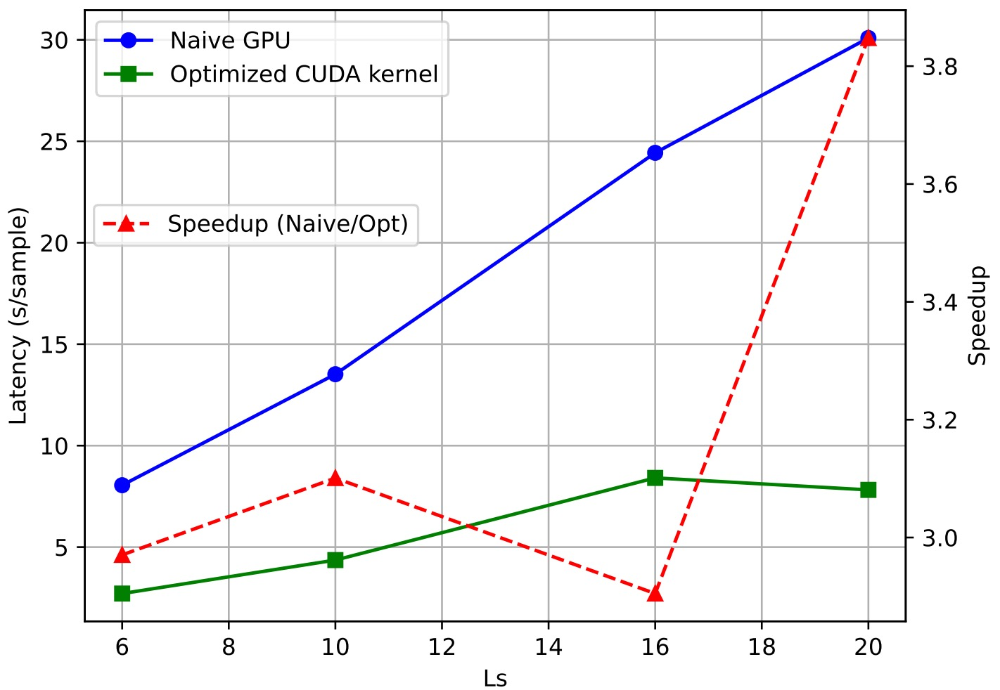

# README
https://arxiv.org/pdf/2508.16298

In this repo, efficient cuda kernels for efficient matrix-vector multiplication is built, which is applied to preconditioned cg algorithm in the context of quantum electrodynamics and fermion coupling. A shared memroy has been used properly in order to reduce the HBM and SRAM communication. **>3x** speedup is achieved, where the baseline is naive gpu usage meaning simply specifying device='cuda'.

## Latency Speedup



The benchmark code is applied in https://github.com/KexinFeng/qed_fermion/tree/pcg


## Cite
```
@article{feng2025scalable,
  title={Scalable Hybrid quantum Monte Carlo simulation of U (1) gauge field coupled to fermions on GPU},
  author={Feng, Kexin and Chen, Chuang and Meng, Zi Yang},
  journal={arXiv preprint arXiv:2508.16298},
  year={2025}
}
```
